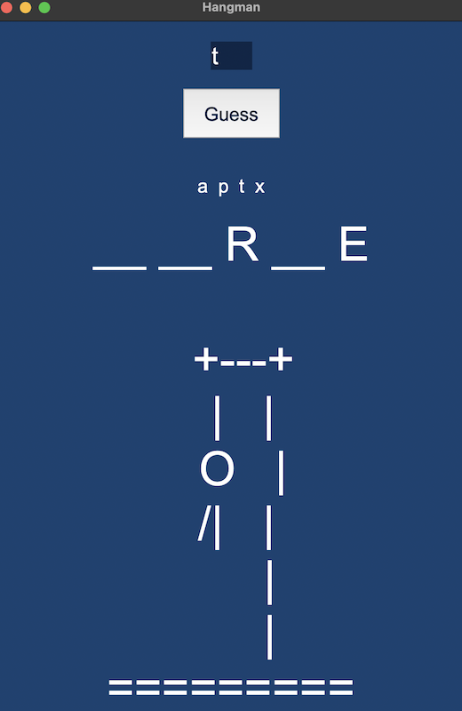

# Hangman
#### Description:
An implementation of Hangman using the tkinter module, complete with hangman ASCII art and
a list of guessed alphabets

## Project Overview
An implementation of Hangman with a GUI.



## Project Files
#### ```hangman.py```
Contains the implementation of ```class Hangman```. To play, an instance of ```Hangman```
needs to be created which will create the GUI and logic to play Hangman.
- ```__init__(self)```:  Creates the GUI: the user input(a tkinter Entry) and submit button(a tkinter Button), the 
 hangman word, hangman stage, and a dummy widget to help positioning (tkinter Labels).
- ```def update_hangman(self)```: The brain of the class, updates the guesses array to reflect guesses, the hangman 
 stage, as well as the hangman text. It first validates user input and then updates the Hangman text if the letter was
 guessed correctly, or the Hangman stage if the letter was guessed incorrectly and increments the tries, then checks
 for game over, in which case it updates the GUI and the Hangman text.
- ```def get_occurrences(word: str, letter: str) -> list```:  Goes through the word and returns the indices of its 
   occurrences in a list. For example, ```get_occurrences("hello", "h")``` will return ```[0]```, used in updating the 
   appropriate instances in the Hangman word(the word the user will see) when an alphabet/letter is guessed correctly. 
- ```def update_hangman_text(word: str, letter: str, hangman_word: list) -> list```: Updates the Hangman text in the
  GUI, i.e. replaces the '__' in the Hangman word with alphabets the user guessed.
- ```def start_game(self)```: Generates the starting dashes according to the word and then updates the GUI so the game
 can be played.
- ```def game_over(self, color: str)```: Updates the GUI background color according to the color passed, used after 
 the game has ended to update the GUI background to red if the user lost, or green if the user won.
- ```def generate_random_word() -> str```: Generates a random word from ```ANIMALS``` in ```hangman_stages.py```, which
 can be modified to display words apart from animals as follows-

Modify ```generate_random_word()``` in class ```Hangman``` to get random words from MIT's 
wordlist:
  ```python
import requests
import random

class Hangman:
  ...
  @staticmethod
  def generate_random_word():
      response = requests.get("https://www.mit.edu/~ecprice/wordlist.10000", timeout=10)
      words = response.content.splitlines()

      word = random.choice(words)
      return word.decode('ascii')
  ...
    
  ```

#### ```hangman_stages.py```
Contains the Hangman stages' ASCII art used in the GUI

#### ```test_hangman.py```
Contains unit tests for the methods used in ```class Hangman``` in ```hangman.py```.
- ```def test_get_occurrences()```: Tests the ```get_occurrences()``` method in ```class Hangman```
- ```def test_random_word()```: Tests the ```generate_random_word()``` method in ```class Hangman```
- ```def test_update_hangman_text()```: Tests the ```update_hangman_text()``` method in ```class Hangman```

## How do I get started?
- Clone the repository
- Run ```hangman.py``` to play Hangman


## How do I clone the repository?
Run the following command-
```
git clone https://github.com/agentblack-6000/hangman.git
```

## Credits and Authors
Created by [agentblack-6000](https://github.com/agentblack-6000)

The project would not have been possible without these libraries-
- tkinter
